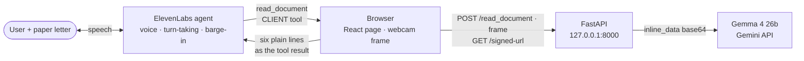

# LetterLens

**Hold a paper letter up to your webcam and talk to it.** A voice-first assistant that reads physical post for blind and low-vision people and explains it in plain English — without ever sending anything on your behalf. The next-action step (calendar, reminder, reply) is designed and not yet built; see Features.

[](LICENSE)
[](skills/letter-reader/SKILL.md)

> Repo directory: `vision-impairment-assistance`. Product: **LetterLens**.

## The problem

Banking, email, the GP app and the council all went digital and screen-reader-accessible. Paper post did not — and it is still the channel the NHS, the DVLA, councils and schools use for the things with deadlines attached. If you are blind, that letter is an envelope and nothing more until someone sighted comes round.

The hospital letter in [`test-letters/01-hospital-appointment.txt`](test-letters/01-hospital-appointment.txt) is the case in miniature: an appointment at 10:40 on Thursday 6 November, arrive fifteen minutes early, and — buried in a paragraph nobody reads aloud — **miss two appointments without telling them and you may be referred back to your GP.**

OCR apps read the whole page out, letterhead and parking advice included. That is transcription, not understanding. LetterLens extracts only the facts that carry a consequence and speaks three sentences: who it is from, what they want, when by.

## Features

- **Point and ask.** Hold the letter to the camera; the agent captures a frame and reads it. No app, no scanner, no sighted help.
- **Three sentences, not three pages.** Sender, request, deadline — under 40 words, spoken.
- **One next action, offered out loud** — *designed, not built.* Add to calendar (`.ics` download), set a reminder, draft a reply: specified in [`agent/persona-prompt.md`](agent/persona-prompt.md) and the skill, with no code in the MVP. `add_event`, `set_reminder` and `draft_reply` have no endpoint and no client-tool registration; the MVP ends at the spoken summary. Same convention as the Accessibility section below: a commitment is labelled as one.
- **Interruptible.** Talk over it mid-sentence and it stops and answers — real barge-in, not a wake word. ElevenLabs-native, and `interruption_mode: "allow"` is set on the tool.
- **Never bluffs.** A failed read asks you to hold the letter closer. It never guesses a date.
- **Nothing is sent.** The agent has one tool and it only reads; it cannot contact anyone on your behalf.
- **Portable skill.** The behaviour ships as an [Agent Skill Open Standard](https://agentskills.io/specification) skill, not welded to this UI.

## How it works



**No tunnel, no inbound connection.** Everything above the Gemini call runs on one laptop; ElevenLabs' cloud never reaches it.

An **ElevenLabs conversational agent** owns the voice session, turn-taking and barge-in. It has **exactly one tool**: `read_document`, registered as a **client tool** in the page — [`agent/tools/read_document.json`](agent/tools/read_document.json) is `"type": "client"`, `expects_response: true`, `response_timeout_secs: 120`, and takes **no parameters**, because it reads whatever the camera can see right now. The agent calls it, the browser grabs the current frame and POSTs it straight to FastAPI on `127.0.0.1:8000`, and the backend sends it to **Gemma 4 on the Gemini API** as `inline_data` base64.

What comes back is **not** a structured object. `POST /read_document` returns `{"text": ..., "elapsed_s": ...}`, where the text is at most six plain lines — `FROM:` / `ABOUT:` / `WHEN:` / `DEADLINE:` / `REF:` / `CONTACT:`, each with a value or `NONE` — and the agent summarises those in its own voice. Plain text rather than JSON is a latency decision, documented in `backend/app.py`: the full letter object measured p50 12.4 s against 4.3–5.4 s for the six lines, and in a voice demo that difference is the product. The nine-field contract in [`output-schema.md`](skills/letter-reader/references/output-schema.md) is therefore the **designed** contract, not the implemented one.

Because the browser is the tool client, there is no public tunnel, no `PUBLIC_BASE_URL` and no shared-secret header — and **one whole demo failure mode disappears with them**, since a tunnel dies quietly mid-demo and takes the read path with it. The only thing still server-side is `GET /signed-url`, which mints a short-lived ElevenLabs conversation token so `ELEVENLABS_API_KEY` never reaches the browser (verified live: HTTP 200 in 1.4 s with a real token). A failed read is also never thrown: `App.tsx` returns a speakable sentence instead, because a throw makes the agent apologise without knowing what went wrong.

**Measured, not assumed** ([note 08](docs/research/08-gemma-live-api-test-results.md)): only `gemma-4-26b-a4b-it` and `gemma-4-31b-it` are served — the original `gemma-3-27b-it` pin 404s. The pin is **`gemma-4-26b-a4b-it`**, and the model choice is the whole ballgame: it answered **8/8 text calls at a 2.0 s median** and read all three test letters correctly on the first attempt, while `gemma-4-31b-it` took 20–57 s and failed roughly half of the same serial calls. Note 08's **3.7–4.5 s is the raw model call only**; see Latency below for the user-visible figure. The split model path note 08 §7 originally proposed is superseded — one Gemma model serves both chat and vision. Quota is **30 RPM per model**, so switching model is a legitimate overflow strategy. Both models are thinking models: filter `thought: true` parts or the agent reads its scratchpad aloud.

### Latency

Measured end to end through the running backend on 2026-10-03 (`docs/mvp-verification.md`): `POST /read_document` with the full-resolution PNGs in `test-letters/` returned **HTTP 200 on the first attempt for all three letters, in 8.1 s, 7.6 s and 8.7 s**, every field verbatim-correct against the known-good `.txt` transcripts — including the reduced-amount deadline picked out of the two dates on the parking penalty. **Budget ~8 seconds per read.** The model call is 3.7–4.5 s of that; the rest is base64-encoding and uploading a ~0.5 MB frame, which is why 3.7–4.5 s must not be quoted as the user-visible number.

It is a **tail** problem, not an average one. `backend/app.py` records 5.1, 5.5, 8.2, 14.4 and **30.5 s** across five consecutive calls on free-tier Gemini, so **demo-day abandon time is 35 seconds** — ten seconds of silence is normal, and `pre_tool_speech: "force"` exists to cover it. The call is bounded by the backend's own `httpx.Timeout(60.0, connect=10.0)`, which stays under the client tool's `response_timeout_secs: 120` so the backend is always the thing that gives up first and can hand back a sentence the agent can say. `LLM_TIMEOUT_MS=8000` does **not** gate this path and must not: a healthy read exceeds it. `backend/app.py` never reads that variable.

## Stack

React 19 + Vite + TypeScript · FastAPI + httpx + Pydantic · ElevenLabs Agents (voice, turn-taking, tools) · Gemma 4 via the Gemini API (vision + extraction) · Apache-2.0.

## Status

As of 2026-10-03: **the one-tool MVP runs end to end on a laptop.** Speak to it, hold a letter up, hear it read back.

**Done** — `backend/app.py` serving `/health`, `/signed-url` and `/read_document` · 42 offline contract tests (`backend/tests/`, `pytest` green) · `frontend/` rewritten off the scaffold (`App.tsx`, `App.css`, `index.css`, `main.tsx`, `index.html`, `@elevenlabs/react` installed) · `agent/tools/read_document.json` as the live client-tool config · `scripts/preflight.py`, `scripts/configure_agent.py` and `scripts/dev.ps1` · agent persona · `letter-reader` Agent Skill + output schema · eight verified research notes · **3/3 test letters read verbatim-correct on the first attempt through the running backend, in 8.1 s, 7.6 s and 8.7 s** with a live key · three synthetic test letters with expected extractions · pinned config · no keys in the repo.

**Not yet** — `draft_reply`, `add_event` and `set_reminder` are **not built**: no endpoint, no client-tool registration, no `.ics` generation, no calendar or reminder card · the six-line reading is not the nine-field object in `output-schema.md` · the accessibility requirements have not been audited against the UI that now exists · p50/p95 under repeated use is unmeasured; the figures above are single first-attempt calls. (`CHAT_MODEL`/`VISION_TIMEOUT_MS` are not pending work: note 08 §10 retired the split path, and they stay commented out on purpose. `PUBLIC_BASE_URL` and `TOOL_WEBHOOK_SECRET` are not pending work either — the client tool removed the need for them entirely.)

<!-- TODO(human): demo GIF/screenshot and video link. -->
<!-- TODO(human): p50/p95 for read_document across repeated calls. Single-call figures are in docs/mvp-verification.md; do not publish an unmeasured distribution. -->

## Quick start

**Prerequisites:** Python 3.11+, Node 20+, a [Google AI Studio key](https://aistudio.google.com/apikey), an [ElevenLabs key + agent ID](https://elevenlabs.io/app/settings/api-keys). **No tunnel** — the browser calls the backend on loopback.

```bash
git clone https://github.com/llygrace034/vision-impairment-assistance
cd vision-impairment-assistance
cp .env.example .env.local        # fill it in — .env.local is gitignored

# backend — run from the REPO ROOT: app.py loads .env.local by relative path
python -m venv .venv && source .venv/bin/activate   # Windows: .venv\Scripts\activate
pip install -r backend/requirements.txt
python -m uvicorn backend.app:app --host 127.0.0.1 --port 8000

# preflight, in another terminal
curl http://127.0.0.1:8000/health   # or: python scripts/preflight.py

# frontend
cd frontend && npm install && npm run dev          # http://localhost:5173
```

`GET /health` is the preflight that matters: it reports which keys actually loaded and which vision model is pinned. Started from inside `backend/` instead of the repo root, the server boots fine and answers `/health` with every key `false` — which then fails mid-demo, out loud. On Windows, `scripts\dev.ps1` runs the preflight and both processes from the right directory in one command.

Every backend variable is documented inline in [`.env.example`](.env.example); the frontend's single variable is in [`frontend/.env.example`](frontend/.env.example), and **a laptop demo needs no frontend env file at all** because `App.tsx` falls back to `http://127.0.0.1:8000`. Set `VITE_BACKEND_URL` only if the backend is not on this machine's loopback, and add that page's exact origin to `CORS_ORIGINS` if you do.

**On the ElevenLabs agent itself** (dashboard, or `python scripts/configure_agent.py`, not `.env`): enable `interruption` under Client Events or barge-in silently fails, and keep `pre_tool_speech: "force"` so the ~8 s vision pause is covered by speech. Both are already set in [`agent/tools/read_document.json`](agent/tools/read_document.json) (`pre_tool_speech: "force"`, `interruption_mode: "allow"`, plus `tool_call_sound_behavior: "always"`). `tool_error_handling_mode` is a **webhook-tool** field and is not available on a client tool, so the earlier "set it to `summarized`" instruction is not implementable here — the equivalent is in the page: `readDocument` returns every failure as a sentence the agent can speak rather than throwing, which is what stops it inventing a success.

## Safety boundaries

Specified in [`agent/persona-prompt.md`](agent/persona-prompt.md) and enforced in the skill.

- **No medical, legal or financial advice.** It says what the letter says and names who to contact. Reading a printed consequence aloud is reading; telling you what to do about it is advice.
- **Nothing is ever sent.** Drafts you copy, files you download — and in the MVP not even that, since `draft_reply` and `add_event` are not built. The agent may not claim otherwise.
- **Read before you speak.** There is no path to the contents except `read_document`, so there is nothing to bluff with.
- **Low confidence is not a summary.** A failed read gives one physical instruction — "hold it a bit closer" — never a partial guess. A confidently wrong date is worse than no answer when the listener cannot check the page.

## Accessibility

Commitments, not achievements — the demo UI exists now, but it has not been audited against these requirements. Full requirements with WCAG references in [`docs/demo-notes.md`](docs/demo-notes.md) §4. Keyboard-only operation including starting the mic · real landmarks and heading order · **no `aria-live` on the agent's own speech** (a screen reader would speak every sentence twice) · large live captions · status in words, never colour alone · patient turn-taking with narrated waiting. **No WCAG conformance is claimed and none has been tested.**

## Repository layout

```
agent/persona-prompt.md        System prompt, operating rules, tool inventory (authoritative)
agent/tools/read_document.json The live client-tool config: type client, no parameters
backend/app.py                 FastAPI: /health, /signed-url, POST /read_document
backend/tests/                 42 offline contract tests — every outbound call mocked
backend/requirements.txt       Backend pins
pytest.ini                     Points pytest at backend/tests
frontend/src/App.tsx           React client: webcam, useConversation, the read_document tool
frontend/.env.example          One variable (VITE_BACKEND_URL) — unneeded for a laptop demo
scripts/preflight.py           Read-only demo preflight: keys, deps, backend cwd, live agent
scripts/configure_agent.py     Pushes the persona + tool onto the live ElevenLabs agent
scripts/dev.ps1                One-command launcher: preflight, backend, frontend
skills/letter-reader/          Agent Skill: SKILL.md + references/output-schema.md (designed contract)
.agents/skills/letter-reader/  Byte-identical copy — the path compliant clients actually scan
docs/submission.md             Hackathon writeup, demo script, prize-track arguments
docs/demo-notes.md             Demo-day notes + accessibility requirements
docs/demo-runbook.md           Print-this runbook, grounded in the current working tree
docs/mvp-verification.md       Live end-to-end verification log with the measured timings
docs/research/                 Eight verified research notes (01–08)
test-letters/                  Three synthetic letters, PNG + TXT, with expected extractions
```

**[`docs/research/`](docs/research/) is worth your click** — eight notes written before the application code, each quoting primary sources with fetch dates and marking its own unconfirmed claims: Gemma on the Gemini API (01) · ElevenLabs Custom LLM (02) · server tools and variables (03) · React SDK (04) · agent creation (05) · the Agent Skills spec (06) · Gemini vision and structured output (07) · **live API test results (08)**, which overturned several of note 01's recommendations and is the reason the model pin is right.

## License

[Apache License 2.0](LICENSE). Open weights in the core, OSI-approved licence on the wrapper.

Full writeup — inspiration, build log, challenges, demo script, prize-track arguments — in **[`docs/submission.md`](docs/submission.md)**.
