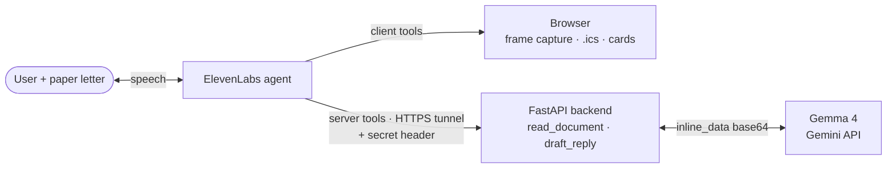

# LetterLens

**Hold a paper letter up to your webcam and talk to it.** A voice-first assistant that reads physical post for blind and low-vision people, explains it in plain English, and offers one next action — without ever sending anything on your behalf.

[](LICENSE)
[](skills/letter-reader/SKILL.md)

> Repo directory: `vision-impairment-assistance`. Product: **LetterLens**.

## The problem

Banking, email, the GP app and the council all went digital and screen-reader-accessible. Paper post did not — and it is still the channel the NHS, the DVLA, councils and schools use for the things with deadlines attached. If you are blind, that letter is an envelope and nothing more until someone sighted comes round.

The hospital letter in [`test-letters/01-hospital-appointment.txt`](test-letters/01-hospital-appointment.txt) is the case in miniature: an appointment at 10:40 on Thursday 6 November, arrive fifteen minutes early, and — buried in a paragraph nobody reads aloud — **miss two appointments without telling them and you may be referred back to your GP.**

OCR apps read the whole page out, letterhead and parking advice included. That is transcription, not understanding. LetterLens extracts a structured object and speaks three sentences: who it is from, what they want, when by.

## Features

- **Point and ask.** Hold the letter to the camera; the agent captures a frame and reads it. No app, no scanner, no sighted help.
- **Three sentences, not three pages.** Sender, request, deadline — under 40 words, spoken.
- **One next action, offered out loud.** Add to calendar (`.ics` download), set a reminder, or draft a reply.
- **Interruptible.** Talk over it mid-sentence and it stops and answers — real barge-in, not a wake word.
- **Never bluffs.** A failed read asks you to hold the letter closer. It never guesses a date.
- **Nothing is sent.** Drafts and files only; the agent cannot contact anyone on your behalf.
- **Portable skill.** The behaviour ships as an [Agent Skill Open Standard](https://agentskills.io/specification) skill, not welded to this UI.

## How it works



An **ElevenLabs conversational agent** owns the voice session, turn-taking and barge-in. Its tools run on three surfaces: `read_document` and `draft_reply` as **server tools** hitting the Python backend over a public HTTPS tunnel authenticated with a shared-secret header (the API key never reaches a browser); `add_event` and `set_reminder` as **client tools** in the page; `end_call` and `skip_turn` natively. The backend sends the frame to **Gemma 4 on the Gemini API** as `inline_data` base64 and gets back a letter object — `doc_type`, `sender`, `reference`, `key_dates`, `deadline`, `amounts`, `actions_required`, `confidence`. Full contract: [`output-schema.md`](skills/letter-reader/references/output-schema.md).

**Measured, not assumed** ([note 08](docs/research/08-gemma-live-api-test-results.md)): only `gemma-4-26b-a4b-it` and `gemma-4-31b-it` are served — the original `gemma-3-27b-it` pin 404s. The pin is **`gemma-4-26b-a4b-it`**, and the model choice is the whole ballgame: it answered **8/8 text calls at a 2.0 s median** and read **all three test letters correctly on the first attempt in 3.7–4.5 s**, while `gemma-4-31b-it` took 20–57 s and failed roughly half of the same serial calls. So `LLM_TIMEOUT_MS=8000` holds with ~4× margin on 26b, and the split model path note 08 §7 originally proposed is superseded — one Gemma model serves both chat and vision. Quota is **30 RPM per model**, so switching model is a legitimate overflow strategy. `responseSchema` is accepted and **silently ignored** (200 with fenced JSON), so the backend validates in Python. Both models are thinking models: filter `thought: true` parts or the agent reads its scratchpad aloud.

## Stack

React 19 + Vite + TypeScript · FastAPI + httpx + Pydantic · ElevenLabs Agents (voice, turn-taking, tools) · Gemma 4 via the Gemini API (vision + extraction) · Apache-2.0.

## Status

As of 2026-10-03: the research, agent design and skill are done; the application code is being written now.

**Done** — agent persona and tool inventory · `letter-reader` Agent Skill + output schema · eight verified research notes · Gemma vision verified end-to-end against all three test letters with a live key · three synthetic test letters with expected extractions · pinned config · no keys in the repo.

**Not yet** — `backend/` is `requirements.txt` only (no entrypoint) · `frontend/` is close to the stock Vite scaffold · `agent/*.json` does not exist · `CHAT_MODEL`/`VISION_TIMEOUT_MS` are commented out and inert · the accessibility work has no UI to apply to yet.

<!-- TODO(human): demo GIF/screenshot and video link once the frontend runs. -->
<!-- TODO(human): measured p50/p95 for read_document end-to-end. Do not publish an unmeasured figure. -->

## Quick start

**Prerequisites:** Python 3.11+, Node 20+, a [Google AI Studio key](https://aistudio.google.com/apikey), an [ElevenLabs key + agent ID](https://elevenlabs.io/app/settings/api-keys), and `ngrok` or `cloudflared`.

```bash
git clone https://github.com/llygrace034/vision-impairment-assistance
cd vision-impairment-assistance
cp .env.example .env.local        # fill it in — .env.local is gitignored

# backend (no start command yet — see Status)
python -m venv .venv && source .venv/bin/activate   # Windows: .venv\Scripts\activate
pip install -r backend/requirements.txt

# public tunnel — ElevenLabs calls IN to your machine
cloudflared tunnel --url http://127.0.0.1:8000     # paste the https URL into PUBLIC_BASE_URL

# frontend
cd frontend && npm install && npm run dev          # http://localhost:5173
```

Every variable is documented inline in [`.env.example`](.env.example). Tunnel URLs change on restart and the agent's tool URLs must be updated to match.

**On the ElevenLabs agent itself** (dashboard, not `.env`): enable `interruption` under Client Events or barge-in silently fails; set `tool_error_handling_mode: "summarized"` on `read_document`, because the default hides webhook errors and the agent then invents a success; set `pre_tool_speech: "force"` so the vision pause is covered by speech.

## Safety boundaries

Specified in [`agent/persona-prompt.md`](agent/persona-prompt.md) and enforced in the skill.

- **No medical, legal or financial advice.** It says what the letter says and names who to contact. Reading a printed consequence aloud is reading; telling you what to do about it is advice.
- **Nothing is ever sent.** Drafts you copy, files you download. The agent may not claim otherwise.
- **Read before you speak.** There is no path to the contents except `read_document`, so there is nothing to bluff with.
- **Low confidence is not a summary.** A failed read gives one physical instruction — "hold it a bit closer" — never a partial guess. A confidently wrong date is worse than no answer when the listener cannot check the page.

## Accessibility

Commitments, not achievements — the UI is not built. Full requirements with WCAG references in [`docs/demo-notes.md`](docs/demo-notes.md) §4. Keyboard-only operation including starting the mic · real landmarks and heading order · **no `aria-live` on the agent's own speech** (a screen reader would speak every sentence twice) · large live captions · status in words, never colour alone · patient turn-taking with narrated waiting. No WCAG conformance is claimed; there is no UI to conform.

## Repository layout

```
agent/persona-prompt.md        System prompt, operating rules, tool inventory (authoritative)
backend/                       FastAPI service behind the server tools — requirements.txt only
frontend/                      React + Vite browser client — close to the stock scaffold
skills/letter-reader/          Agent Skill: SKILL.md + references/output-schema.md
.agents/skills/letter-reader/  Byte-identical copy — the path compliant clients actually scan
docs/submission.md             Hackathon writeup, demo script, prize-track arguments
docs/demo-notes.md             Demo-day runbook + accessibility requirements
docs/research/                 Eight verified research notes (01–08)
test-letters/                  Three synthetic letters, PNG + TXT, with expected extractions
```

**[`docs/research/`](docs/research/) is worth your click** — eight notes written before the application code, each quoting primary sources with fetch dates and marking its own unconfirmed claims: Gemma on the Gemini API (01) · ElevenLabs Custom LLM (02) · server tools and variables (03) · React SDK (04) · agent creation (05) · the Agent Skills spec (06) · Gemini vision and structured output (07) · **live API test results (08)**, which overturned several of note 01's recommendations and is the reason the model pin is right.

## License

[Apache License 2.0](LICENSE). Open weights in the core, OSI-approved licence on the wrapper.

Full writeup — inspiration, build log, challenges, demo script, prize-track arguments — in **[`docs/submission.md`](docs/submission.md)**.
